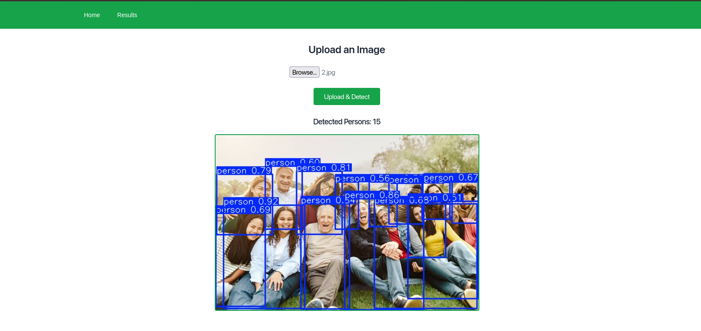
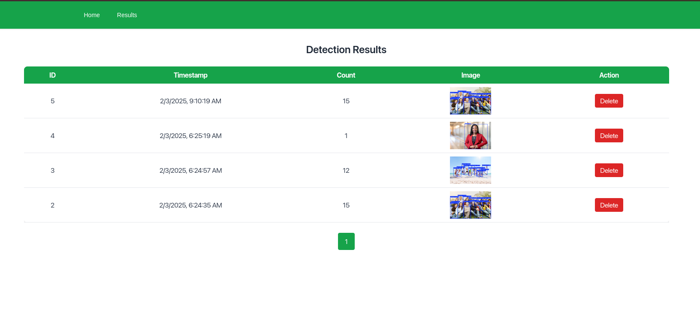
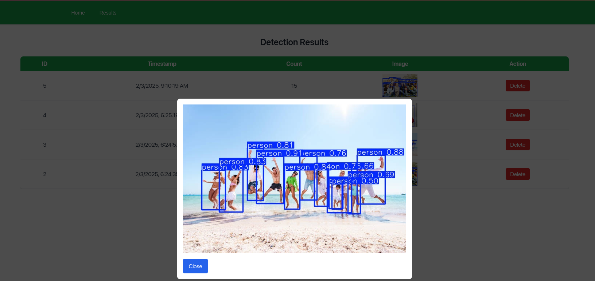

# Person Detector Web App

## Context

Basic web app for person detection in uploaded image

Frameworks:
1. Backend: Python, FastAPI, API data validation
2. Frontend: Next JS
3. Database: PosgreSQL + SQLAlchemy
4. Deployment: Docker compose

## Build and run

```
# Docker version 27.5.1, build 9f9e405
docker compose up --build
```

Open browser and go to `localhost:3000`

## Preview

[Video demo](https://youtu.be/KQp-1Efz69I?t=480)





